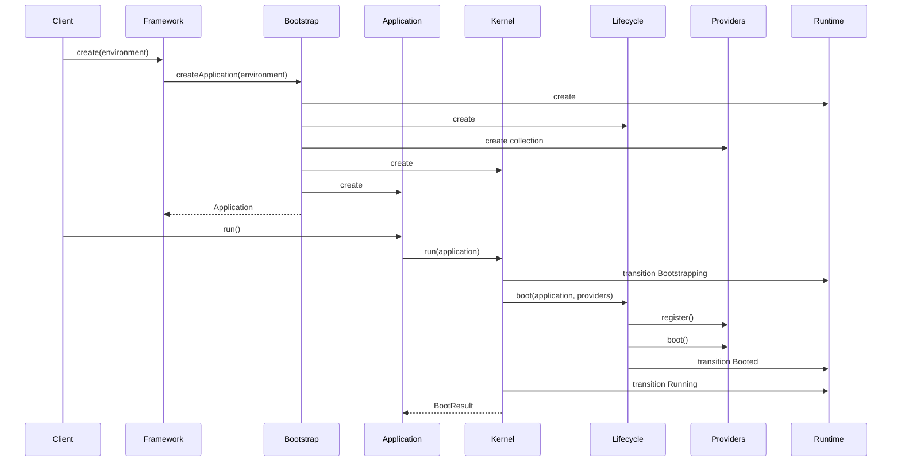
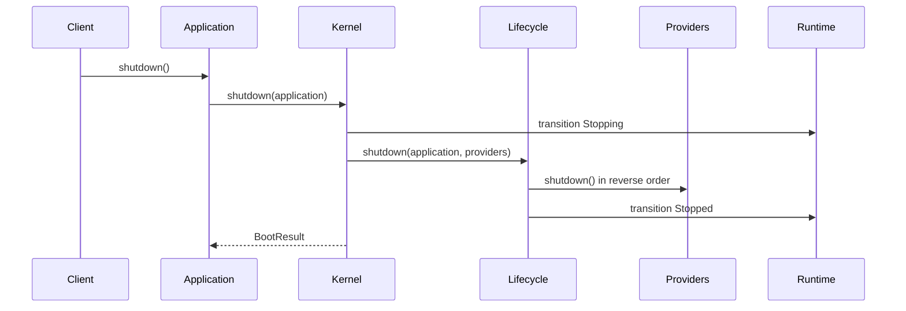

# WP-003 — Runtime Foundation Specification

**Document ID:** SPEC-WP-003-RUNTIME-FOUNDATION  
**Version:** 1.0.0  
**Framework Version:** SIF 2.0.0-alpha1  
**Status:** Approved  
**Date:** 2026-07-15  
**Owner:** SIF Architecture Board  
**Product Owner:** Aníbal Catapano  
**Architecture Authority:** Chief Software Architect  
**Implementation Status:** Approved for implementation  
**Supersedes:** None  
**Related ADRs:** ADR-0001, ADR-0002, ADR-0003, ADR-0004  

---

## 1. Purpose

This specification defines the Runtime Foundation of SIF.

The Runtime Foundation is responsible for creating, bootstrapping, running, stopping, and reporting the state of a SIF application. It provides the minimal execution model required by future framework components, including the dependency injection container, configuration, events, modules, audit, ORM, console, HTTP, assets, resources, SDK, installer, builder, and AI services.

The implementation must remain small, stable, observable, extensible, and fully testable.

---

## 2. Scope

WP-003 includes the following production components:

- `Framework`
- `Application`
- `Runtime`
- `Kernel`
- `Bootstrap`
- `Lifecycle`
- `Environment`
- `ServiceProvider`
- `ServiceProviderCollection`
- `BootStage`
- `BootResult`
- Runtime contracts
- Runtime exceptions
- Runtime DTOs
- Runtime event definitions
- Component metadata
- Unit tests
- Integration tests
- Component documentation
- Usage examples
- Implementation report

WP-003 does not implement:

- Dependency injection container internals
- Configuration repository internals
- Event dispatcher
- Module loader
- HTTP request handling
- Console command routing
- Database or ORM
- Audit storage
- Asset management
- Resource management
- AI providers

Integration points for those components must be prepared explicitly without introducing production placeholders.

---

## 3. Architectural Principles

### 3.1 Core independence

The Runtime Foundation must not depend on optional modules.

### 3.2 Service orientation

Runtime collaborators must be represented through contracts where substitution is expected.

### 3.3 No global state

The implementation must not use:

- Global variables
- Global helper functions
- Static mutable state
- Hidden service locators
- Singletons

### 3.4 Minimal public surface

Only APIs explicitly listed in this specification are public and compatibility-protected.

### 3.5 Observability

Lifecycle transitions must be observable without modifying runtime implementation.

WP-003 defines event objects and observer integration points. The event dispatcher itself belongs to a later Work Package.

### 3.6 Extensibility

Extension must occur through:

- Contracts
- Service Providers
- Lifecycle hooks
- Event integration points

The Runtime must not require source modification to add future framework services.

### 3.7 Compatibility

Public APIs introduced by this Work Package must not be broken without:

- A documented technical reason
- An ADR
- A migration plan
- A version change compliant with SemVer

---

## 4. Package Layout

```text
src/
└── Foundation/
    ├── Framework.php
    ├── Application.php
    ├── Runtime.php
    ├── Kernel.php
    ├── Bootstrap.php
    ├── Lifecycle.php
    ├── Environment.php
    ├── ServiceProvider.php
    ├── ServiceProviderCollection.php
    ├── BootStage.php
    ├── BootResult.php
    ├── Contracts/
    │   ├── ApplicationInterface.php
    │   ├── KernelInterface.php
    │   ├── RuntimeInterface.php
    │   ├── BootstrapInterface.php
    │   ├── LifecycleInterface.php
    │   ├── EnvironmentInterface.php
    │   └── ServiceProviderInterface.php
    ├── DTO/
    │   ├── BootError.php
    │   └── BootWarning.php
    ├── Events/
    │   ├── FrameworkBooting.php
    │   ├── FrameworkBooted.php
    │   ├── ApplicationCreated.php
    │   ├── ApplicationBooted.php
    │   ├── KernelBooting.php
    │   ├── KernelBooted.php
    │   ├── ApplicationStopping.php
    │   ├── ApplicationStopped.php
    │   └── FrameworkFailed.php
    └── Exceptions/
        ├── FoundationException.php
        ├── RuntimeException.php
        ├── InvalidRuntimeTransitionException.php
        ├── ApplicationBootException.php
        ├── KernelBootException.php
        ├── BootstrapException.php
        ├── DuplicateServiceProviderException.php
        └── ServiceProviderNotFoundException.php
```

Tests:

```text
tests/
└── Foundation/
    ├── Unit/
    ├── Integration/
    └── Fixtures/
```

Documentation and metadata:

```text
src/Foundation/
├── README.md
├── CHANGELOG.md
├── component.json
└── component.lock

engineering/
├── reviews/
│   └── WP-003-Implementation-Report.md
└── specifications/
    └── WP-003-Runtime-Foundation.md
```

---

## 5. Namespace and Autoloading

All production classes in this Work Package must use:

```php
namespace Sif\Foundation;
```

Subdirectories must map to sub-namespaces:

```text
Sif\Foundation\Contracts
Sif\Foundation\DTO
Sif\Foundation\Events
Sif\Foundation\Exceptions
```

Composer PSR-4 mapping must be:

```json
{
  "autoload": {
    "psr-4": {
      "Sif\\": "src/"
    }
  }
}
```

Test namespaces must use:

```text
Sif\Tests\Foundation
```

---

## 6. Runtime State Model

The Runtime must expose a strict state machine.

Allowed states:

```text
Created
Bootstrapping
Booted
Running
Stopping
Stopped
Failed
```

No other states are permitted in WP-003.

Allowed transitions:

```text
Created -> Bootstrapping
Bootstrapping -> Booted
Booted -> Running
Running -> Stopping
Stopping -> Stopped

Created -> Failed
Bootstrapping -> Failed
Booted -> Failed
Running -> Failed
Stopping -> Failed
```

Forbidden transitions must throw `InvalidRuntimeTransitionException`.

A `Failed` runtime is terminal in WP-003.

A `Stopped` runtime is terminal in WP-003.

---

## 7. Boot Stages

`BootStage` must be implemented as a PHP 8.2 backed enum.

Required cases:

```php
enum BootStage: string
{
    case Created = 'created';
    case Environment = 'environment';
    case Bootstrap = 'bootstrap';
    case Providers = 'providers';
    case Booted = 'booted';
    case Running = 'running';
    case Shutdown = 'shutdown';
    case Failed = 'failed';
}
```

The enum may include helper methods only when they are deterministic and side-effect free.

---

## 8. Environment

`Environment` must be an immutable value object.

Supported names:

- `development`
- `testing`
- `staging`
- `production`

Unknown values are allowed only when explicitly created through a named constructor that permits custom environments.

Required public API:

```php
public static function development(): self;
public static function testing(): self;
public static function staging(): self;
public static function production(): self;
public static function custom(string $name): self;

public function name(): string;
public function isDevelopment(): bool;
public function isTesting(): bool;
public function isStaging(): bool;
public function isProduction(): bool;
public function equals(self $other): bool;
public function __toString(): string;
```

The constructor must not be public.

Empty environment names are invalid.

---

## 9. Framework

`Framework` is the only public entry point intended for application developers.

It must remain a minimal bootstrap façade and must not become a service locator.

Required public API:

```php
final class Framework
{
    public static function create(
        ?Environment $environment = null,
        ?BootstrapInterface $bootstrap = null
    ): ApplicationInterface;

    public static function run(
        ?Environment $environment = null,
        ?BootstrapInterface $bootstrap = null
    ): BootResult;

    public static function version(): string;
}
```

Rules:

- `create()` creates a new independent application instance.
- `run()` creates and runs a new application.
- `version()` returns `2.0.0-alpha1`.
- No mutable static application instance may be stored.
- No singleton behavior is permitted.
- Framework must delegate creation to `BootstrapInterface`.

---

## 10. Application

`Application` represents one SIF application instance.

Required responsibilities:

- Own the runtime instance
- Own the kernel instance
- Own the environment value
- Own the service provider collection
- Expose lifecycle operations
- Prevent invalid repeated boot or shutdown calls

Required public API:

```php
public function runtime(): RuntimeInterface;
public function kernel(): KernelInterface;
public function environment(): EnvironmentInterface;
public function providers(): ServiceProviderCollection;

public function boot(): BootResult;
public function run(): BootResult;
public function shutdown(): BootResult;
```

Rules:

- Application must not contain framework service implementations.
- Application must not implement container resolution in WP-003.
- Application must be created through Bootstrap.
- `run()` must boot first when necessary.
- Repeated safe calls may be idempotent only where specified by tests.
- Invalid lifecycle use must raise a specific Foundation exception.

---

## 11. Runtime

`Runtime` owns runtime state and transition history.

Required public API:

```php
public function state(): RuntimeState;
public function stage(): BootStage;
public function isCreated(): bool;
public function isBootstrapping(): bool;
public function isBooted(): bool;
public function isRunning(): bool;
public function isStopping(): bool;
public function isStopped(): bool;
public function hasFailed(): bool;

public function transitionTo(RuntimeState $state, BootStage $stage): void;
public function fail(\Throwable $cause, BootStage $stage): void;
public function failure(): ?\Throwable;
public function startedAt(): ?\DateTimeImmutable;
public function stoppedAt(): ?\DateTimeImmutable;
```

`RuntimeState` may be introduced as an enum under `Foundation` or `Foundation\DTO`, provided it remains part of the component and is documented.

Rules:

- State transition validation belongs to Runtime.
- Runtime timestamps must use `DateTimeImmutable`.
- Runtime must not read global time through hidden static state when a clock abstraction already exists in WP-002.
- If WP-002 provides a clock or timer contract, inject and use it.
- Failure cause must be retained.
- Transition history may be included if implemented as an immutable DTO collection.

---

## 12. Kernel

`Kernel` orchestrates the application lifecycle.

Required public API:

```php
public function boot(ApplicationInterface $application): BootResult;
public function run(ApplicationInterface $application): BootResult;
public function shutdown(ApplicationInterface $application): BootResult;
```

Responsibilities:

1. Transition runtime into bootstrapping.
2. Execute lifecycle stages in the approved order.
3. Register providers.
4. Boot providers.
5. Transition runtime to booted and running.
6. Shut down providers in reverse order.
7. Convert failures into `BootResult`.
8. Mark Runtime as failed when an unrecoverable exception occurs.

Kernel must not:

- Resolve arbitrary services
- Read configuration files directly
- Instantiate optional modules
- Perform HTTP or console dispatch
- Access the database
- Write files
- Use global state

---

## 13. Bootstrap

`Bootstrap` is responsible for constructing a valid runtime graph.

Required public API:

```php
public function createApplication(EnvironmentInterface $environment): ApplicationInterface;
```

Responsibilities:

- Create Runtime
- Create Lifecycle
- Create ServiceProviderCollection
- Create Kernel
- Create Application
- Return the fully wired Application

Bootstrap must use constructor injection.

Bootstrap must not boot or run the application.

A custom `BootstrapInterface` implementation must be accepted by `Framework::create()` and `Framework::run()`.

---

## 14. Lifecycle

`Lifecycle` defines and executes ordered runtime stages.

Required public API:

```php
public function bootStages(): array;
public function shutdownStages(): array;

public function boot(
    ApplicationInterface $application,
    ServiceProviderCollection $providers
): BootResult;

public function shutdown(
    ApplicationInterface $application,
    ServiceProviderCollection $providers
): BootResult;
```

Required boot order:

1. Environment
2. Bootstrap
3. Providers registration
4. Providers boot
5. Booted
6. Running

Required shutdown order:

1. Shutdown requested
2. Provider shutdown in reverse registration order
3. Stopped

Rules:

- The stage sequence must be deterministic.
- Provider failures must be captured.
- Critical failures must stop the current lifecycle.
- Shutdown must attempt remaining provider shutdown operations only when safe and must record all errors in `BootResult`.

---

## 15. Service Provider Contract

`ServiceProvider` is the base abstraction for runtime extensions.

Required API:

```php
abstract class ServiceProvider implements ServiceProviderInterface
{
    public function register(ApplicationInterface $application): void;
    public function boot(ApplicationInterface $application): void;
    public function shutdown(ApplicationInterface $application): void;
}
```

Default `boot()` and `shutdown()` implementations may be no-op.

`register()` must remain abstract.

Provider rules:

- Providers must not be singletons by requirement.
- Provider instances are owned by `ServiceProviderCollection`.
- Providers register capabilities and future services through the Application integration points.
- Providers must not mutate Runtime state directly.
- Providers must not call Kernel lifecycle methods.

---

## 16. ServiceProviderCollection

The collection must be type-safe and preserve insertion order.

Required public API:

```php
public function add(ServiceProviderInterface $provider): void;
public function has(string $providerClass): bool;
public function get(string $providerClass): ServiceProviderInterface;
public function all(): array;
public function reverse(): array;
public function count(): int;
public function isEmpty(): bool;
```

Rules:

- Duplicate provider classes are rejected.
- Missing providers raise a specific exception.
- Returned arrays must contain only `ServiceProviderInterface`.
- Iteration support may be implemented using `IteratorAggregate`.
- Count support may be implemented using `Countable`.

---

## 17. BootResult

`BootResult` must be immutable.

Required data:

- Success status
- Final stage
- Start time
- End time
- Duration in milliseconds
- Errors
- Warnings
- Optional failure cause

Required public API:

```php
public static function success(
    BootStage $stage,
    \DateTimeImmutable $startedAt,
    \DateTimeImmutable $finishedAt,
    array $warnings = []
): self;

public static function failure(
    BootStage $stage,
    \DateTimeImmutable $startedAt,
    \DateTimeImmutable $finishedAt,
    array $errors,
    ?\Throwable $cause = null,
    array $warnings = []
): self;

public function succeeded(): bool;
public function failed(): bool;
public function stage(): BootStage;
public function startedAt(): \DateTimeImmutable;
public function finishedAt(): \DateTimeImmutable;
public function durationMilliseconds(): float;
public function errors(): array;
public function warnings(): array;
public function cause(): ?\Throwable;
```

Errors and warnings must be represented by DTOs, not unstructured arrays.

---

## 18. BootError and BootWarning DTOs

Required fields:

- Code
- Message
- Stage
- Context

Context must be an array of scalar, null, and serializable values.

DTOs must be immutable.

They must implement `JsonSerializable`.

They must not expose throwable stack traces by default.

---

## 19. Runtime Events

WP-003 must define event data objects, but not dispatch them.

Required event classes:

- `FrameworkBooting`
- `FrameworkBooted`
- `ApplicationCreated`
- `ApplicationBooted`
- `KernelBooting`
- `KernelBooted`
- `ApplicationStopping`
- `ApplicationStopped`
- `FrameworkFailed`

Each event must:

- Be immutable
- Include the Application or Runtime relevant to the event
- Include timestamp
- Be serializable where safe
- Contain no dispatch logic

The future Event Dispatcher Work Package will consume these objects.

---

## 20. Capability Preparation

WP-003 must prepare capability registration without implementing a complete module registry.

Minimum requirement:

```php
public function capabilities(): array;
public function hasCapability(string $capability): bool;
```

Capability names must be normalized lowercase identifiers using dots where hierarchy is needed.

The Runtime Foundation must register:

```text
runtime
foundation
providers
lifecycle
```

Future components will register their own capabilities through Service Providers or a dedicated registry.

Do not implement dynamic module loading in WP-003.

---

## 21. Exception Hierarchy

All Foundation exceptions must extend:

```php
Sif\Foundation\Exceptions\FoundationException
```

Required exceptions:

- `RuntimeException`
- `InvalidRuntimeTransitionException`
- `ApplicationBootException`
- `KernelBootException`
- `BootstrapException`
- `DuplicateServiceProviderException`
- `ServiceProviderNotFoundException`

No production code may throw base `Exception` directly.

Native exceptions may be wrapped when component context is required.

---

## 22. Public API Stability

Compatibility-protected public APIs in 2.0.0-alpha1:

- `Framework::create()`
- `Framework::run()`
- `Framework::version()`
- `ApplicationInterface`
- `KernelInterface`
- `RuntimeInterface`
- `BootstrapInterface`
- `EnvironmentInterface`
- `ServiceProviderInterface`
- `BootStage`
- `BootResult`

Other classes may remain internal until promoted by a future specification.

Internal classes must be marked in PHPDoc:

```php
@internal
```

---

## 23. Lifecycle Sequence



---

## 24. Shutdown Sequence



---

## 25. Testing Requirements

### 25.1 Unit tests

Required unit test coverage for:

- Environment creation and comparison
- Runtime valid transitions
- Runtime invalid transitions
- Runtime failure state
- BootStage values
- BootResult success
- BootResult failure
- ServiceProviderCollection ordering
- Duplicate provider rejection
- Missing provider rejection
- Bootstrap graph creation
- Framework custom bootstrap support
- Application lifecycle delegation
- Kernel lifecycle orchestration
- Lifecycle provider order
- Lifecycle reverse shutdown order

### 25.2 Integration tests

Required integration scenarios:

1. Create an application through `Framework::create()`.
2. Run an application successfully.
3. Register two providers and verify register/boot order.
4. Shut down and verify reverse order.
5. Fail one provider and verify failed Runtime and BootResult.
6. Create two applications and verify no shared mutable state.
7. Use a custom Bootstrap implementation.
8. Verify capability registration.

### 25.3 Coverage

Minimum line coverage:

```text
90%
```

Minimum branch coverage when tooling is available:

```text
80%
```

Coverage exclusions require documented justification.

---

## 26. Static Analysis

WP-003 must include or use project-level PHPStan configuration.

Minimum target:

```text
PHPStan level 8
```

If the repository has no PHPStan configuration, the implementation must add:

```text
phpstan.neon
```

The configuration must include:

```text
src/Foundation
tests/Foundation
```

No baseline may be introduced for new WP-003 code.

---

## 27. Code Style

Requirements:

- PHP 8.2
- `declare(strict_types=1);`
- PSR-12
- Typed properties
- Return type declarations
- Constructor property promotion where it improves clarity
- Readonly classes or properties for immutable DTOs where appropriate
- No dynamic properties
- No `mixed` unless technically unavoidable and documented
- No `@` error suppression
- No `eval`
- No global functions
- No direct output
- No hidden I/O

---

## 28. Composer and Reproducibility

The component must be reproducible from a clean checkout.

Requirements:

- Production code must have no third-party runtime dependencies.
- PHPUnit must be declared in `require-dev`.
- PHPStan may be declared in `require-dev`.
- Composer lockfile must be generated and committed where current repository policy requires component lockfiles.
- `composer validate --strict` must pass.
- Autoload files must be regenerated.

Tool versions must remain compatible with PHP 8.2.

---

## 29. Component Metadata

`component.json` must include:

```json
{
  "id": "foundation.runtime",
  "name": "Runtime Foundation",
  "framework_version": "2.0.0-alpha1",
  "component_version": "1.0.0",
  "status": "alpha",
  "php": "^8.2",
  "namespace": "Sif\\Foundation",
  "dependencies": [
    "support"
  ],
  "capabilities": [
    "runtime",
    "foundation",
    "providers",
    "lifecycle"
  ],
  "public_contracts": [],
  "service_providers": [],
  "documentation": [
    "README.md",
    "CHANGELOG.md"
  ]
}
```

`public_contracts` must be populated with implemented contract class names.

`component.lock` must record:

- Exact component version
- Framework version
- File manifest
- SHA-256 hashes
- Development tool versions
- Test summary
- Generation timestamp in UTC

---

## 30. Documentation Deliverables

Required:

- `src/Foundation/README.md`
- `src/Foundation/CHANGELOG.md`
- Complete PHPDoc
- Example application under `examples/foundation/`
- `engineering/reviews/WP-003-Implementation-Report.md`

README must document:

- Purpose
- Architecture
- Public API
- Lifecycle
- Providers
- Capabilities
- Error handling
- Example
- Extension points
- Limitations in alpha1

---

## 31. Implementation Report

The implementation report must include:

- Work Package metadata
- Summary
- Files created
- Files modified
- Public API introduced
- Test count
- Assertion count
- Coverage
- Composer validation status
- PHPStan status
- Code style status
- Risks
- Deviations from specification
- Recommended next Work Package actions

Any deviation must be explicit.

---

## 32. Quality Gate

WP-003 is accepted only when all applicable checks pass:

```text
Architecture review       PASS
Composer validate         PASS
Composer install          PASS
PHPUnit                    PASS
Line coverage >= 90%      PASS
PHPStan level 8           PASS
PSR-12                     PASS
PHPDoc                     PASS
README                     PASS
CHANGELOG                  PASS
component.json             PASS
component.lock             PASS
Examples                   PASS
Implementation report     PASS
```

A failed gate blocks merge.

---

## 33. Acceptance Criteria

WP-003 is complete when:

1. `Framework::create()` creates a valid independent Application.
2. `Framework::run()` executes the runtime lifecycle.
3. Runtime state transitions are validated.
4. Kernel orchestrates boot, run, and shutdown.
5. Bootstrap constructs the runtime graph.
6. Lifecycle executes deterministic stages.
7. Providers register and boot in insertion order.
8. Providers shut down in reverse order.
9. Boot failures produce a failed Runtime and `BootResult`.
10. Multiple applications do not share mutable state.
11. Capability discovery works.
12. Tests and quality gates pass.
13. Documentation and metadata are complete.
14. No optional module dependency exists.

---

## 34. Phase Breakdown

### Phase 1 — Runtime Core

- Framework
- Application
- Runtime
- Environment
- Base contracts
- Base exceptions
- Initial tests
- Reproducible Composer development setup

### Phase 2 — Lifecycle Orchestration

- Kernel
- Bootstrap
- Lifecycle
- BootStage
- BootResult
- Boot DTOs
- Tests
- PHPStan configuration if absent

### Phase 3 — Service Providers

- ServiceProvider
- ServiceProviderInterface
- ServiceProviderCollection
- Provider exceptions
- Ordering tests
- Failure tests

### Phase 4 — Observability Preparation

- Runtime event objects
- Capabilities
- Event integration points
- Integration tests

### Phase 5 — Product Completion

- README
- CHANGELOG
- component.json
- component.lock
- Example
- Implementation report
- Full quality gate

Each phase must remain reviewable and must not introduce unrelated components.

---

## 35. Risks

### 35.1 Framework façade expansion

Risk: `Framework` becomes a global service locator.

Mitigation: Restrict it to creation, execution, and version reporting.

### 35.2 Application responsibility growth

Risk: `Application` accumulates service logic.

Mitigation: Application owns state and collaborators but delegates execution.

### 35.3 Kernel coupling

Risk: Kernel begins knowing optional services.

Mitigation: Integrate future services through contracts and providers.

### 35.4 Premature event implementation

Risk: Runtime builds an event dispatcher before the Events Work Package.

Mitigation: Define immutable event objects only.

### 35.5 Non-deterministic lifecycle

Risk: Provider order changes across runs.

Mitigation: Preserve collection insertion order and test it.

---

## 36. Preparation for Next Work Package

WP-003 must prepare clean integration points for:

- Dependency Injection Container
- Configuration Repository
- Event Dispatcher
- Module Registry
- Context
- Audit
- Builder
- Console
- HTTP

The expected next Work Package is:

```text
WP-004 — Dependency Injection Container
```

WP-004 must be able to integrate without changing the compatibility-protected APIs listed in this specification.

---

## 37. Change Control

Changes to this specification require:

1. A documented proposal.
2. Architecture review.
3. ADR when the change affects public API or component boundaries.
4. Updated version metadata.
5. Updated changelog.

---

## 38. Specification Changelog

### 1.0.0 — 2026-07-15

- Initial approved Runtime Foundation specification.
- Defined runtime state machine.
- Defined Framework, Application, Runtime, Kernel, Bootstrap, and Lifecycle responsibilities.
- Defined Service Provider lifecycle.
- Defined quality gates.
- Defined reproducibility and PHPStan requirements.
- Defined capability preparation and observability event objects.
